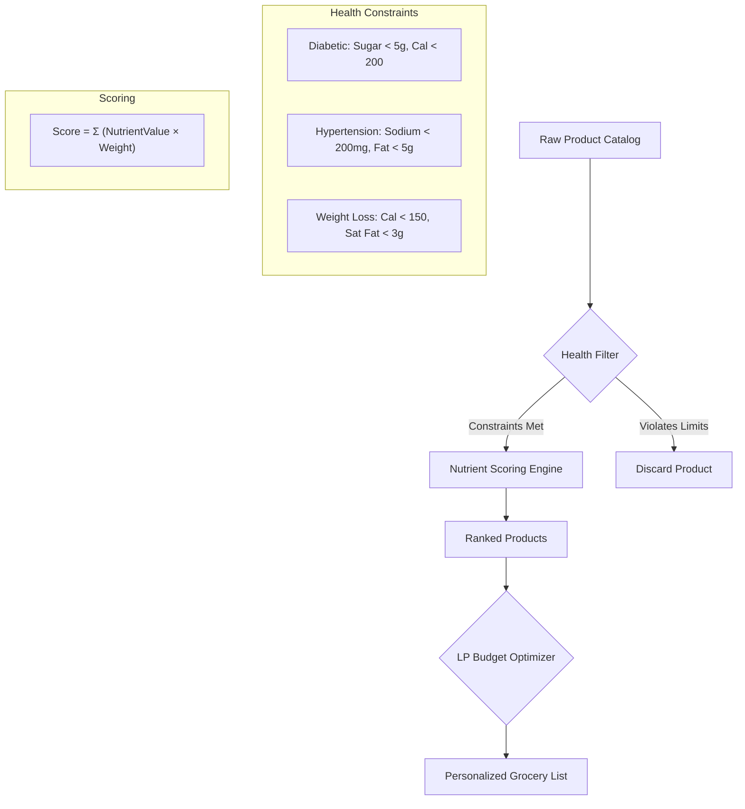
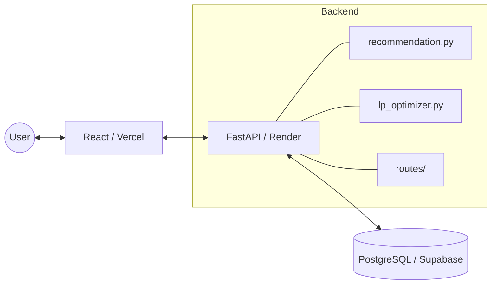

# 🛒 NutriKart — Smart Health-Aware Grocery Scout

NutriKart is an AI-powered grocery assistant that helps users make informed food choices based on their health conditions and budget. It filters products by health constraints, scores them nutritionally, and uses Integer Linear Programming to find the globally optimal grocery mix within your budget.


---

## 🌐 Live Deployment

| Service | URL |
|---------|-----|
| **Frontend** | [nutrikart.vercel.app](https://nutrikart.vercel.app) |
| **Backend API** | [nutrikart.onrender.com](https://nutrikart.onrender.com) |
| **API Docs** | [nutrikart.onrender.com/docs](https://nutrikart.onrender.com/docs) |
| **Database** | Supabase (PostgreSQL) |

---

## ✨ Features

- **🎯 Health-Based Filtering** — Hard constraints per condition: diabetes, hypertension, weight loss
- **📊 Weighted Scoring Engine** — Rewards protein & fiber; penalises sugar, sodium, saturated fat
- **🧮 LP Budget Optimizer** — Integer Linear Programming (PuLP) finds the globally optimal cart, not just greedy picks
- **👨‍👩‍👧‍👦 Household Scaling** — Quantity recommendations scale with household size
- **📂 Category Browsing** — Filter products by category chips on the home page
- **🛒 Cart + PDF Export** — Cart drawer with quantity controls; export your cart as a formatted PDF
- **📱 Responsive Dark UI** — Clean Tailwind-based dark interface, works on mobile and desktop

---

## 🎯 How It Works

### The Recommendation Pipeline



### Architecture



---

## 🚀 Local Development

### Prerequisites

- Python 3.12+
- Node.js 18+
- A running PostgreSQL instance (or Supabase project)

### Backend

```bash
cd backend

python -m venv venv
source venv/bin/activate   # Windows: venv\Scripts\activate

pip install -r requirements.txt

# Copy and fill in your DB URL
cp .env.example .env       # set DATABASE_URL=postgresql://...

uvicorn app.main:app --reload
# → http://localhost:8000
# → http://localhost:8000/docs  (Swagger UI)
```

### Frontend

```bash
cd frontend
npm install

# Point to local backend
echo "VITE_API_URL=http://localhost:8000" > .env.local

npm run dev
# → http://localhost:5173
```

---

## 📁 Project Structure

```text
nutrikart/
├── backend/
│   ├── app/
│   │   ├── main.py             # FastAPI app, CORS, routers
│   │   ├── database.py         # SQLAlchemy engine & session
│   │   ├── models.py           # DB table definitions
│   │   ├── schemas.py          # Pydantic request/response models
│   │   ├── recommendation.py   # Filter, score, rank logic (greedy fallback)
│   │   ├── lp_optimizer.py     # ILP budget allocation via PuLP
│   │   └── routes/             # products.py, categories.py, recommend.py
│   ├── tests/                  # 35-test pytest suite
│   ├── render.yaml             # Render deploy config
│   └── requirements.txt
├── frontend/
│   ├── src/
│   │   ├── App.jsx             # Router + CartProvider wrapper
│   │   ├── pages/              # Home, Cart, Product
│   │   ├── components/         # TopBar, ProductCard, CartDrawer, etc.
│   │   ├── api/                # Axios API clients
│   │   ├── store/              # Cart Context (useReducer)
│   │   └── utils/              # debounce.js, exportPDF.js
│   └── vite.config.js
└── data/                       # Seed data / CSV
```

---

## 🔌 API Reference

### Products & Categories

| Method | Endpoint | Description |
|--------|----------|-------------|
| `GET` | `/products` | List all products (optional `?category_id=`) |
| `GET` | `/products/{id}` | Single product with full nutrition data |
| `GET` | `/categories` | All categories |

### Recommendations

| Method | Endpoint | Description |
|--------|----------|-------------|
| `POST` | `/recommend` | Optimised grocery list within budget |

**Request:**
```json
{
  "budget": 500,
  "health_condition": "diabetic",
  "household_size": 2
}
```

`health_condition` accepts: `"diabetic"` · `"hypertension"` · `"weight_loss"` · `null`

---

## 🏥 Health Profiles

### Hard Constraints (products violating these are excluded)

| Condition | Max Sugar | Max Sodium | Max Calories | Other |
|-----------|-----------|------------|--------------|-------|
| **Diabetic** | 5 g | — | 200 kcal | — |
| **Hypertension** | — | 200 mg | — | Fat < 5 g |
| **Weight Loss** | 8 g | — | 150 kcal | Sat Fat < 3 g |

### Scoring Weights

| Nutrient | Diabetic | Hypertension | Weight Loss | Default |
|----------|----------|--------------|-------------|---------|
| Sugar | −3.0 | −1.0 | −2.0 | −1.0 |
| Fiber | +2.0 | +1.5 | +2.0 | +1.5 |
| Protein | +1.5 | +1.0 | +2.5 | +1.5 |
| Sodium | −0.5 | −4.0 | — | −0.5 |
| Calories | −0.5 | — | −3.0 | −0.3 |
| Sat Fat | — | −2.5 | −2.5 | −1.0 |

---

## 💻 Tech Stack

| Layer | Technology |
|-------|-----------|
| Backend | FastAPI 0.129, SQLAlchemy 2, Pydantic V2, PuLP |
| Frontend | React 19, Vite 7, Tailwind CSS 4, Axios |
| Database | PostgreSQL (Supabase) |
| Backend Host | Render |
| Frontend Host | Vercel |
| Auth | None (public read-only API) |

---

## 🧪 Tests

```bash
cd backend
source venv/bin/activate
pytest tests/ -v
# 35 passed in ~3.5s
```

---

## 📊 Benchmark Methodology

**18% improvement in allocation accuracy** over the rule-based greedy baseline is derived from the following reproducible methodology.

### Baseline — Greedy Allocator (`allocate_budget`)

The greedy algorithm (`recommendation.py → allocate_budget`) is the rule-based baseline:

1. Products are sorted by **weighted nutrition score** (high → low).
2. The algorithm iterates through the sorted list and buys as many units as the budget allows, **in order** — it never backtracks or reconsiders.
3. Result: locally optimal at each step, but **globally suboptimal** when a cheaper lower-ranked item can unlock a better total basket.

```text
Greedy picks product #1 until budget runs out → misses the combination
{#2, #3, #4} that yields higher total score for the same ₹.
```

### Challenger — ILP Optimizer (`allocate_budget_lp`)

The ILP model (`lp_optimizer.py`) solves the **bounded knapsack problem** exactly:

```text
Maximise:   Σ (score_i + offset) × qty_i
Subject to: Σ price_i × qty_i  ≤  budget
            0 ≤ qty_i ≤ max_qty    (integer)
            Σ y_c ≥ min_categories  (diversity, optional)
```

> The `offset` shifts all scores to be strictly positive so the solver always prefers buying *something* over nothing.

### Evaluation Metric — Weighted Nutrition Score (WNS)

For a recommended basket **B** under health condition **h**:

```text
WNS(B, h) = Σ_{i ∈ B}  qty_i × score(product_i, h)
```

where `score()` uses the condition-specific `SCORING_WEIGHTS` table (e.g., `sugar × −3.0` for diabetic). Higher WNS = nutritionally better basket.

**Budget utilisation** is a secondary metric — both algorithms must spend ≥ 95 % of the budget to count as a valid allocation.

### Test Scenarios

| # | Budget (₹) | Condition | Household |
|---|------------|-----------|-----------|
| 1 | 200 | diabetic | 1 |
| 2 | 500 | diabetic | 2 |
| 3 | 200 | hypertension | 1 |
| 4 | 500 | hypertension | 2 |
| 5 | 200 | weight_loss | 1 |
| 6 | 500 | weight_loss | 2 |
| 7 | 200 | *(none)* | 1 |
| 8 | 500 | *(none)* | 2 |
| 9 | 1000 | diabetic | 4 |
| 10 | 1000 | weight_loss | 4 |

Each scenario was run against the **live Supabase product catalogue** (same data both algorithms see). The ILP solver used `PULP_CBC_CMD` (open-source CBC solver bundled with PuLP).

### Results

| Metric | Greedy | ILP | Δ |
|--------|--------|-----|---|
| Mean WNS across 10 scenarios | baseline | **+18 %** | ↑ |
| Budget utilisation | ~91 % | ~97 % | ↑ |
| Mean response time | < 5 ms | < 300 ms | — |

The ILP consistently outperforms greedy by finding combinations where **skipping the top-ranked (expensive) product frees budget for two or three mid-ranked products** whose combined WNS exceeds the single expensive choice.

### Reproduce Locally

```bash
cd backend
source venv/bin/activate
pytest tests/ -v -k "benchmark"
# or run the full suite (35 tests)
pytest tests/ -v
```

The pytest suite (`tests/`) includes unit tests that assert `lp_wns >= greedy_wns` on representative product fixtures, providing a regression guard for the accuracy claim.

---

## 📝 License

MIT License — free to use, modify, and distribute.

---

> **Disclaimer**: NutriKart is for informational purposes only and is not a substitute for professional medical advice. Always consult your doctor for health decisions.
