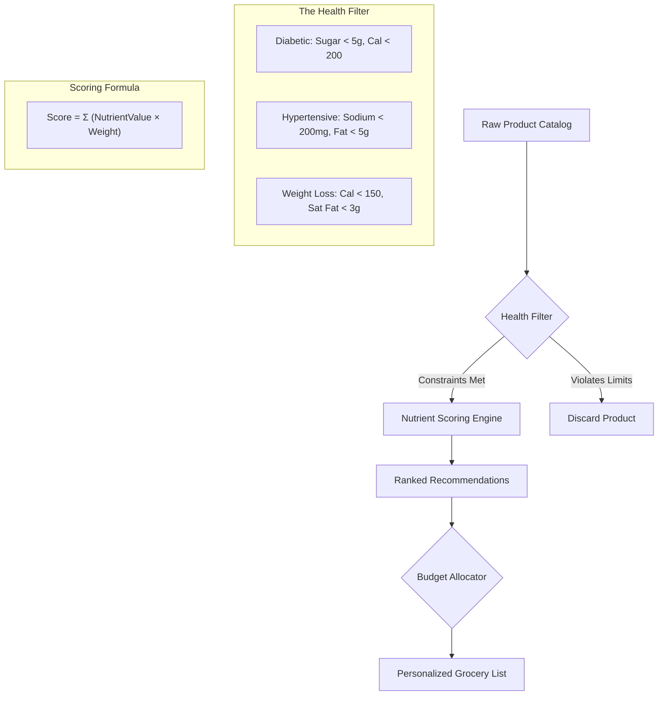
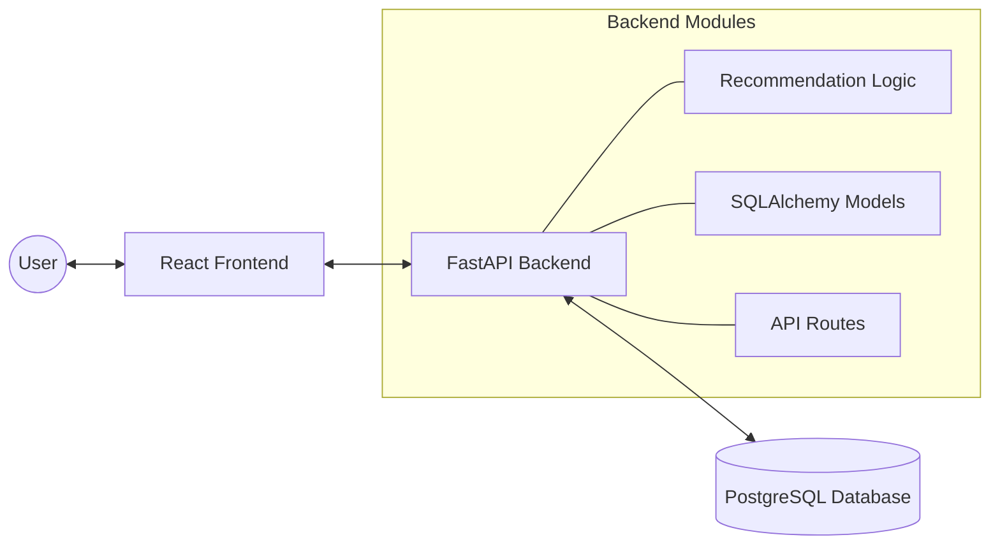

# 🛒 NutriKart - Smart Health-Aware Grocery Scout

NutriKart is an AI-powered grocery assistant that helps users make informed food choices based on their health conditions and budget. By analyzing nutritional data and applying personlized constraints, NutriKart recommends the best products for your health and wallet.


---

## ✨ Features

- **🎯 Health-Based Filtering**: Automatically filters products based on health conditions like Diabetes, Hypertension, and Weight Loss.
- **📊 Weighted Scoring Engine**: Ranks products using a sophisticated scoring system that rewards beneficial nutrients (fiber, protein) and penalizes harmful ones (sugar, sodium, saturated fat).
- **💰 Smart Budget Allocation**: Greedily allocates your grocery budget to the highest-scoring healthy products, ensuring you get the most nutritional value for your money.
- **👨‍👩‍👧‍👦 Household Scaling**: Adjusts recommendation quantities based on your household size.
- **📂 Category Organization**: Browse and filter products by categories (e.g., Grains, Dairy, Snacks).
- **📱 Modern Dashboard**: A clean, responsive React-based interface for managing your grocery list and viewing health scores.

---

## 🎯 How It Works

### 📊 The Recommendation Pipeline

NutriKart uses a multi-stage pipeline to transform a raw product list into a personalized grocery plan.



### 🏗️ Architecture



---

## 🚀 Quick Start

### Prerequisites

- Python 3.10+
- Node.js 18+

### Backend Setup

```bash
cd backend

# Create and activate virtual environment
python -m venv venv
source venv/bin/activate  # On Windows: venv\Scripts\activate

# Install dependencies
pip install -r requirements.txt

# Run the server
uvicorn app.main:app --reload
```
The API will be available at `http://localhost:8000`.

### Frontend Setup

```bash
cd frontend

# Install dependencies
npm install

# Run development server
npm run dev
```
The app will be available at `http://localhost:5173`.

---

## 📁 Project Structure

```text
nutrikart/
├── backend/
│   ├── app/
│   │   ├── main.py             # FastAPI entry point
│   │   ├── models.py           # SQLAlchemy models
│   │   ├── schemas.py          # Pydantic validation schemas
│   │   ├── database.py         # DB connection & base classes
│   │   ├── recommendation.py   # Core filtering & scoring logic
│   │   └── routes/             # API route handlers
│   └── tests/                  # Backend test suite
├── frontend/
│   ├── src/
│   │   ├── App.jsx             # Main application & routing
│   │   ├── components/         # Reusable UI components
│   │   ├── pages/              # Page views (Home, Cart, Product)
│   │   ├── store/              # State management (Context API)
│   │   └── api/                # Axios API clients
│   └── public/                 # Static assets
└── data/                       # Sample data / DB files
```

---

## 🔌 API Endpoints

### Products & Categories
| Method | Endpoint | Description |
|--------|----------|-------------|
| GET | `/products` | List all products |
| GET | `/products/{id}` | Get detailed product info |
| GET | `/categories` | List all categories |

### Recommendations
| Method | Endpoint | Description |
|--------|----------|-------------|
| POST | `/recommend` | Get personalized grocery recommendations |

**Sample `/recommend` Request Body:**
```json
{
  "health_condition": "diabetic",
  "budget": 50.0,
  "household_size": 2
}
```

---

## 🏥 Health Profiles & Logic

NutriKart applies specific constraints and weights based on the selected health condition:

### Constraints (Hard Limits)
| Condition | Max Sugar | Max Sodium | Max Calories | Max Fat/Sat Fat |
|-----------|-----------|------------|--------------|-----------------|
| **Diabetic** | 5g | - | 200 kcal | - |
| **Hypertension** | - | 200mg | - | 5g Fat |
| **Weight Loss** | 8g | - | 150 kcal | 3g Sat Fat |

### Scoring Weights (Rewards/Penalties)
| Nutrient | Diabetic | Hypertension | Weight Loss |
|----------|----------|--------------|-------------|
| **Sugar** | -3.0 | -1.0 | -2.0 |
| **Fiber** | +2.0 | +1.5 | +2.0 |
| **Protein** | +1.5 | +1.0 | +2.5 |
| **Sodium** | -0.5 | -4.0 | - |
| **Calories** | -0.5 | - | -3.0 |

---

## 💻 Tech Stack

- **Backend**: [FastAPI](https://fastapi.tiangolo.com/), [SQLAlchemy](https://www.sqlalchemy.org/), [Pydantic](https://docs.pydantic.dev/)
- **Frontend**: [React](https://reactjs.org/), [Vite](https://vitejs.dev/), [Tailwind CSS](https://tailwindcss.com/)
- **Database**: [PostgreSQL](https://www.postgresql.org/)

---

## 📝 License

This project is licensed under the MIT License.

---

**Disclaimer**: NutriKart is a tool for informational purposes only and is not a substitute for professional medical advice, diagnosis, or treatment. Always seek the advice of your physician or other qualified health provider with any questions you may have regarding a medical condition.
