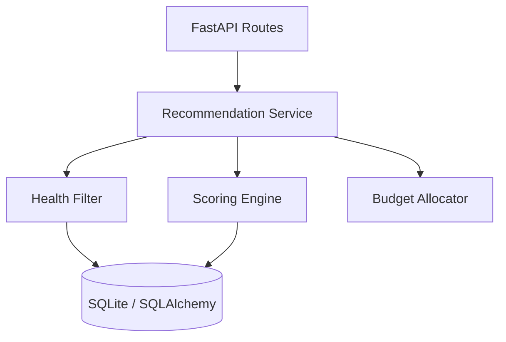

# ⚙️ NutriKart Backend

The NutriKart backend is a high-performance, asynchronous API built with FastAPI. It handles product management, health-based filtering, and a weighted scoring engine for grocery recommendations.

## 🏗️ Architecture & Logic Flow

The backend follows a service-oriented structure where the recommendation logic is decoupled from the API routes and database models.



### Core Services
- **Health Filter**: Removes products that exceed nutrient thresholds (e.g., max sugar for diabetics).
- **Scoring Engine**: Calculates a health score for each product based on condition-specific weights.
- **Budget Allocator**: A greedy algorithm that picks the best-scored items within a price limit.

---

## 📁 Directory Structure

```text
backend/
├── app/
│   ├── main.py             # App initialization & middleware
│   ├── database.py         # DB connection & base classes
│   ├── models.py           # SQLAlchemy database tables
│   ├── schemas.py          # Pydantic models for API validation
│   ├── recommendation.py   # Filtering, scoring, and allocation logic
│   └── routes/             # API request handlers
│       ├── products.py     # Product CRUD & search
│       ├── categories.py   # Category management
│       └── recommend.py    # Recommendation endpoint
├── tests/                  # Pytest suite for backend logic
└── requirements.txt        # Python dependencies
```

---

## 🚀 Setup & Installation

### 1. Environment Setup
Ensure you have Python 3.10+ installed.

```bash
# Create a virtual environment
python -m venv venv

# Activate the environment
# MacOS/Linux:
source venv/activate
# Windows:
venv\Scripts\activate
```

### 2. Install Dependencies
```bash
pip install -r requirements.txt
```

### 3. Run the Server
```bash
uvicorn app.main:app --reload
```
The server will start at `http://localhost:8000`. You can access the auto-generated documentation at `http://localhost:8000/docs`.

---

## 🧪 Running Tests
We use `pytest` for testing the recommendation logic and API routes.

```bash
pytest
```

---

## 🛠️ Technologies
- **Framework**: [FastAPI](https://fastapi.tiangolo.com/)
- **ORM**: [SQLAlchemy](https://www.sqlalchemy.org/)
- **Validation**: [Pydantic](https://docs.pydantic.dev/)
- **Database**: [SQLite](https://www.sqlite.org/)
- **Server**: [Uvicorn](https://www.uvicorn.org/)
