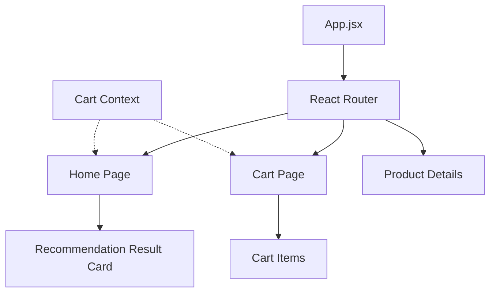

# 🎨 NutriKart Frontend

The NutriKart frontend is a modern, responsive web application built with React and Vite. it provides an intuitive interface for users to browse products, select health conditions, and get optimized grocery recommendations.

## 🏗️ UI Architecture

The frontend is organized into pages and reusable components, with state management handled by React Context API.



---

## 📁 Directory Structure

```text
frontend/
├── src/
│   ├── App.jsx             # Main routing & layout
│   ├── main.jsx            # Entry point
│   ├── components/         # Reusable UI elements (Navbar, Buttons, etc.)
│   ├── pages/              # Full page views
│   │   ├── Home.jsx        # Recommendation dashboard
│   │   ├── Cart.jsx        # Shopping cart view
│   │   └── Product.jsx     # Individual product details
│   ├── api/                # Axios instances & API call services
│   ├── store/              # Context Providers (Cart, User, etc.)
│   ├── utils/              # Helper functions & formatting
│   └── index.css           # Global styles (Tailwind CSS)
├── public/                 # Static assets (images, icons)
├── package.json            # Scripts & dependencies
└── vite.config.js          # Vite configuration
```

---

## 🚀 Setup & Installation

### 1. Install Dependencies
Ensure you have Node.js 18+ installed.

```bash
npm install
```

### 2. Run the Development Server
```bash
npm run dev
```
The application will be accessible at `http://localhost:5173`.

### 3. Build for Production
```bash
npm run build
```

---

## 🛠️ Core Technologies
- **UI Framework**: [React 18](https://react.dev/)
- **Build Tool**: [Vite](https://vitejs.dev/)
- **Styling**: [Tailwind CSS](https://tailwindcss.com/)
- **Routing**: [React Router](https://reactrouter.com/)
- **HTTP Client**: [Axios](https://axios-http.com/)
- **State Management**: [Context API](https://react.dev/learn/passing-data-deeply-with-context)

---

## 💡 Key Components
- **`Home` Page**: The main interface where users choose their health condition and budget to receive recommendations.
- **`Cart` Context**: Manages the global state of selected items and optimized lists.
- **`RecommendationCard`**: Displays the product score and nutritional breakdown.
