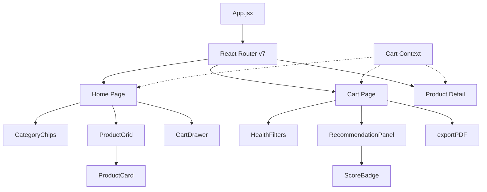

# 🎨 NutriKart Frontend

React + Vite frontend for NutriKart. Deployed on **Vercel**, talks to the FastAPI backend on Render.

**Live App:** `https://nutrikart.vercel.app`

---

## 🏗️ UI Architecture



---

## 📁 Structure

```text
frontend/
├── src/
│   ├── App.jsx                 # Router + CartProvider wrapper
│   ├── main.jsx                # React DOM entry point
│   ├── index.css               # Global CSS / Tailwind base
│   ├── pages/
│   │   ├── Home.jsx            # Product catalog with category chips
│   │   ├── Cart.jsx            # Cart review + recommendation engine UI
│   │   └── Product.jsx         # Product detail with nutrition table
│   ├── components/
│   │   ├── TopBar.jsx          # Sticky header with cart badge
│   │   ├── ProductCard.jsx     # Grid card with Add button
│   │   ├── ProductGrid.jsx     # Responsive product grid
│   │   ├── CategoryChips.jsx   # Horizontal filter chips
│   │   ├── CartDrawer.jsx      # Slide-in cart panel
│   │   ├── HealthFilters.jsx   # Condition filter chips (Cart page)
│   │   ├── RecommendationPanel.jsx  # Recommended products list
│   │   ├── NutritionTable.jsx  # Per-serving nutrition breakdown
│   │   └── ScoreBadge.jsx      # Color-coded health score pill
│   ├── api/
│   │   ├── client.js           # Axios instance (reads VITE_API_URL)
│   │   ├── catalog.js          # getProducts, getCategories, getProduct
│   │   └── recommend.js        # getRecommendations (POST /recommend)
│   ├── store/
│   │   └── cartContext.jsx     # Cart state via useReducer + Context
│   └── utils/
│       ├── debounce.js         # Debounce utility (used for recommendation fetch)
│       └── exportPDF.js        # jsPDF cart export
├── public/
│   └── NutriKart.png           # App icon
├── .env.production             # VITE_API_URL for production build
├── index.html
├── package.json
└── vite.config.js
```

---

## 🚀 Local Setup

```bash
# 1. Install dependencies
npm install

# 2. Point to local backend
echo "VITE_API_URL=http://localhost:8000" > .env.local

# 3. Start dev server
npm run dev
# → http://localhost:5173
```

### Build for production

```bash
npm run build
# Output: dist/
```

---

## 🌍 Environment Variables

| Variable | Description |
|----------|-------------|
| `VITE_API_URL` | Base URL of the FastAPI backend. Set in Vercel dashboard or `.env.production`. |

Production value: `https://nutrikart.onrender.com`

---

## ☁️ Deployment (Vercel)

Settings in the Vercel project dashboard:

- **Root directory:** `frontend`
- **Framework preset:** Vite
- **Build command:** `npm run build`
- **Output directory:** `dist`
- **Env var:** `VITE_API_URL = https://nutrikart.onrender.com`

---

## 💡 Key Design Decisions

- **Cart state via `useReducer`** — predictable state transitions; avoids prop drilling across all three pages
- **Debounced recommendations** — Cart page debounces the `POST /recommend` call by 400 ms, so rapid quantity changes only fire one request
- **`health_condition` → `null`** — UI stores `"none"` internally for the chip selection; converts to `null` before the API call (backend rejects `"none"`)
- **Lazy image loading** — `loading="lazy"` on all product images for faster initial paint
- **PDF export** — Uses `jsPDF` + `jspdf-autotable`; generates a cart summary with nutrition totals, downloadable client-side

---

## 🛠️ Tech Stack

| | |
|---|---|
| UI Framework | React 19 |
| Build Tool | Vite 7 |
| Styling | Tailwind CSS 4 |
| Routing | React Router 7 |
| HTTP | Axios |
| State | Context API + useReducer |
| PDF | jsPDF + jspdf-autotable |
